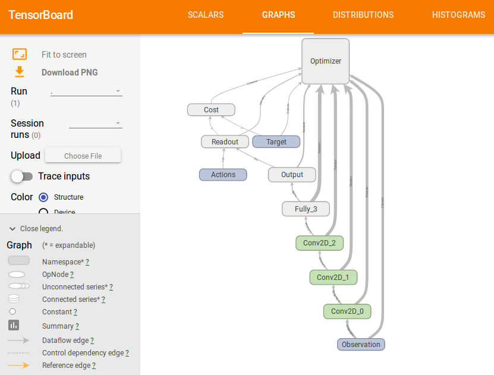

# TensorBlock

Tensorblock is an API to facilitate the implementation of Machine Learning Algorithms using TensorFlow: [BitBucket/TensorBlock](https://bitbucket.org/vguizilini/tensorblock/overview).  

## Overview

In the *reinforcement* folder, [*players*](../reinforcement/players) contain the the Reinforcement Learning algorithms/agents, that consiste in two files, one for the core algorithm, describing the *agent* operations and training, and one for the neural network model used.  
Also in the *reinforcement* folder, [*sources*](../reinforcement/sources) contain the files that are the interface to the environments, like the OpenAi's Gym, Pygame, Mujoco or Unity.  
The [*tensorblock*](../tensorblock) folder cointains all the functions and classes that facilitates the implementation of the algorithms on the *reinforcement* folder.   
The [*execute*](../reinforcement/execute.py) file runs it all.

## Usage

The algorithms are trained using the command:
```shell
python execute.py source_*your_source* player_*your_player*  
```
There are some flags that can be used:  
```shell
--save *your_saved_model_name*  
--load *your_saved_model_name*  
--run (just run and do not train)  
```
There are some scripts on the *reinforcement* folder, and saved trained models.

## TensorBoard

TensorBoard is easy to use. It is implemented in some algorithms, such as in [reinforce_2](REINFORCE.md), and can be easily reproduced in others.

<div align="center">



</div>
